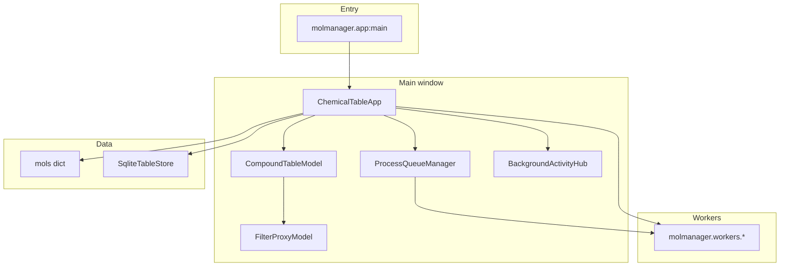

# MolManager architecture

Desktop chemistry table manager: **PyQt5** UI, **RDKit** structures, optional **PyTorch** tools (pKa, permeability).

## High-level layout

## Main window (`molmanager/ui/main_window/`)

`ChemicalTableApp` composes mixins (multiple inheritance):

| Mixin | Responsibility |
|--------|----------------|
| `SessionMixin` | Open/save `.cms` sessions; legacy CSV import (composes session_* mixins) |
| `SessionSaveMixin` | Document build, File open/save/new/duplicate |
| `SessionTableLayoutMixin` | Header/layout chrome collect/restore |
| `SessionPlotsMixin` | Docked/floating plot + protein viewer session state |
| `SessionRestoreMixin` | CMS async restore, finalize steps, workspace reveal |
| `SessionCsvMixin` | Legacy CSV session load |
| `AppLifecycleMixin` | Session dirty / SQLite mirror / close-shutdown |
| `AppProgressMixin` | Status chrome and tool-progress UI |
| `AppMenuMixin` | Menubar, dock-results chrome, workspace dialog openers |
| `TableUIMixin` | Column color/sort, `clear_all`, confs sidecar, selection browser (composes table mixins) |
| `TableSelectionMixin` | Row/column selection, visibility cache, OID override / chunked select |
| `TableChemistryAccessMixin` | Molecule lookup, chemistry-tool source columns, OID→row |
| `TableEditMixin` | Copy/paste, chunked delete/clear cells |
| `TableMenuMixin` | Column/row/cell context menus, log/precision column transforms |
| `IngestExportMixin` | File/SQL ingest, export |
| `ChemistryMixin` | Composite tools mixin (see sub-mixins below) |
| `ClusterMixin` | Clustering dialogs |
| `DimensionReductionMixin` | PCA / t-SNE / UMAP docking |
| `MedChemSpaceMixin` | MedChem space plot |
| `QsarMixin` | QSAR entry points |
| `GuiSettingsMixin` | Persisted UI settings |

`QMainWindow` precedes mixins in the MRO, so Qt virtuals such as `closeEvent` must be declared on `ChemicalTableApp` (delegating into the mixin). Mixin implementations that need the C++ base should call `QMainWindow.closeEvent` explicitly rather than `super()`.

`ChemistryMixin` composes (same MRO order):

| Sub-mixin | Responsibility |
|-----------|----------------|
| `PlotToolsMixin` | Plot↔table sync, floating plot dialogs; docks via `PlotDockHost` |
| `IngestRenderMixin` | File ingest chunks, SQLite rebuild, 2D render batch |
| `PrepareStructuresMixin` | Fast prepare, disconnect/neutralize, render-2D tools |
| `ConformersDescriptorsMixin` | Conformers, superposition, descriptor calc |
| `FragmentToolsMixin` | BRICS/RECAP/R-group fragment tools |
| `MmpMixin` | Matched molecular pair (MMP / rdMMPA) analysis |
| `ReactionToolsMixin` | Reaction-based enumeration |
| `ToolsSqlPredictMixin` | Calculator, SQL load, external DB, pKa/permeability |

**Filter bounds:** bulk load/ingest calls `schedule_calculate_global_bounds()` (debounced); undo and session JSON restore call `calculate_global_bounds()` immediately when filter cards need fresh min/max.

## Table and visibility

- **Source of truth:** `CompoundTableModel` (`_rows`, OIDs, batched `dataChanged`) in
  `ui/compound_table_model.py`, composed from structure / bounds / bulk / color mixins.
- **View stack:** `ui/compound_table_view.py` (`CompoundTableView`, `StructureDelegate`,
  `CompoundTableHeaderView`); re-exported from `compound_table_model` for stable imports.
- **Helpers:** `services/numeric_bounds.py` (filter slider min/max scans);
  `column_color_compute.py` (gradient / categorical RGB).
- **Filtered view:** `FilterProxyModel` hides rows by OID set (`set_visible_oids`), not per-row `setRowHidden`.
- **Selection:** Qt selection + `_selected_oids_override` for large selections (tools/plots use `_selected_oids_set()`); logic lives in `TableSelectionMixin`.
- **SQLite mirror:** `SqliteTableStore` powers text/numeric filter pushdown and column search at 100k+ rows. Rebuilt in chunks on the GUI thread, then `SqliteRebuildWorker` builds the DB file.

## Background work

| Mechanism | Used for |
|-----------|----------|
| `ProcessQueueManager` | Serial heavy tools (descriptors, cluster, export, …) |
| `threadpool` | Substructure filter, dimred, MedChem space, SQLite export chunks |
| `_render_threadpool` | 2D structure rendering |
| `_background_jobs` + `BackgroundActivityHub` | **Processes** dialog rows for non-queue work |

Progress: `WorkerSignals.tool_progress` + `ToolProgressState` polling → bottom `status_label`.

## Plots and table sync

- **Plotter:** `ui/plot.py` (`PlotWidget`)
- **Dock host:** `ui/plot_dock_host.py` (`PlotDockHost`) owns dock/undock, panel width, and pane close; `PlotToolsMixin` delegates the public API
- **PCA / radar / dimred:** `ui/plotly_interactive_view.py`
- **Shared helpers:** `ui/plot_table_sync.py` (selection mapping, clear override); `ui/plotly_shell.py` (interactive Plotly HTML/JS for Plotter + Plotly views)
- **Table → plot:** debounced `_schedule_sync_active_plots_from_table_selection`
- **Plot → table:** `apply_table_selection_for_source_rows`
- **Filters / edits:** `_schedule_active_plots_replot` after filter apply; `dataChanged` on model for open plots
- **Substructure (large tables):** one or more SMARTS cards run via `SubstructureFilterWorker` off the GUI; sync/chunked apply consume override OID sets
- **UI workflow benchmark:** `scripts/benchmark_ui_workflows.py` times CSV load, `.cms` restore, filters, plot collect/replot, search, export

## Adding a new Tool

1. Dialog under `molmanager/ui/dialogs/` (use `scope.selection_scope_checked`, `parent_app` on docked panels).
2. Worker under `molmanager/workers/` if work is heavy.
3. Wire menu action in `chemical_table_app.py` / `chemistry_mixin.py`.
4. Long jobs: `process_queue.enqueue` + `_begin_tool_progress` / `report_tool_progress`.
5. Short threadpool jobs: `register_background_job` / `unregister_background_job`.
6. Tests under `tests/` (unit tests avoid full GUI where possible).

## Chemistry workers layout

Heavy chemistry jobs are split by concern (compat re-exports remain in `workers/chemistry_tools.py`):

| Module | Responsibility |
|--------|----------------|
| `workers/chemistry_descriptors.py` | Descriptor `CalcWorker` |
| `workers/chemistry_conformers.py` | Conformers, superpose, RMSD, strain |
| `workers/chemistry_calc.py` | Custom calculator (AST `safe_calc`) |
| `workers/chemistry_worker_common.py` | Shared progress throttling |

Pure helpers live under `molmanager/services/` (e.g. `chemistry_columns.py`, `sql_load_policy.py`,
`table_scope.py`, `activity_records.py`, `table_selection.py`, `sqlite_text_match.py`,
`filter_config.py`, `column_labels.py`, `structure_grouping.py`). Domain modules must not import
`molmanager.ui`; Plotly legend cleanup lives in `molmanager/plotly_legend.py` (re-exported from
`ui/plotly_html.py`). Shared lineage header is `COLUMN_PARENT_OID` (`"Parent OID"`).
MMP / Activity Cliff / Pair Network / SALI share `ui/analysis_job_support.py` for scoped
activity-record prep, process-queue enqueue (`start_scoped_activity_job`), dialog open/finish
helpers (`ensure_activity_analysis_ready`, `finish_analysis_pairs`, `report_analysis_failure`).
Cluster / pKa / SOM / protomer / permeability reuse the same module for table readiness
(`ensure_table_ready_for_tool`), structure-scoped mol collect (`prepare_scoped_structure_mols`),
enqueue (`enqueue_process_queue_job` / `start_scoped_structure_job`), and cancellable failure
reporting (`report_cancellable_job_failure`). Mixins and dialogs stay thin adapters over those helpers.

Filter visibility changes invalidate a sticky `_visible_source_rows_cache` used by
plot replot (so debounced Plotter rebuilds do not rematerialize proxy maps per host).
`FilterProxyModel` is an explicit OID→row map (`QAbstractProxyModel`): `set_visible_oids`
rebuilds the accepted source-row list once instead of
`QSortFilterProxyModel.invalidateFilter` walking every row. `visible_source_rows()` seeds
the sticky cache without a `mapToSource` loop. Column insert/remove is forwarded 1:1
(`beginInsertColumns` / `beginRemoveColumns`) so the table view updates section count;
without that, deletes leave blank columns and new descriptor columns never appear.
When visibility does not change, finalize skips reset/replot.

Plotter axis/mode/histogram helpers live in `molmanager/plot_axes.py` (re-exported from
`ui/plot.py`). Series collection for scatter/histogram lives in `molmanager/plot_collect.py`.
Floating plot chrome is split into `ui/plot_bridge.py`, `ui/plot_statistics_panel.py`, and
`ui/plot_dialog.py`. Figure builders live in `ui/plot_render_mixin.py`; shell load/push and
table↔plot selection in `ui/plot_shell_mixin.py`; color/size/hover/fit in
`ui/plot_style_mixin.py`; axis/plot-type controls in `ui/plot_axis_mixin.py`; radar options in
`ui/plot_radar_mixin.py`; series collection in `ui/plot_collect_mixin.py`; session save/restore
in `ui/plot_session_mixin.py` (`PlotWidget` in `ui/plot.py` owns UI construction and orchestration).
Fingerprint session cache is an LRU capped by `fingerprint_cache_max_entries`
(`MOLMANAGER_FINGERPRINT_CACHE_MAX_ENTRIES`).

Auto Render 2D after ingest/session: small tables wait for depictions before reveal;
at/above `structure_render_lazy_after_ingest_min_rows` the workspace opens immediately
while Structure images continue in the background (`_auto_render2d_blocks_workspace_reveal`).

## Related docs

- [CONTRIBUTING.md](CONTRIBUTING.md) — coding standards, CI lint/headers, dependency audit
- [STEREO_AND_ISOMERISM.md](STEREO_AND_ISOMERISM.md)
- [VALENCE_BONDS_AND_AROMATICITY.md](VALENCE_BONDS_AND_AROMATICITY.md)
- [PACKAGING.md](PACKAGING.md)
