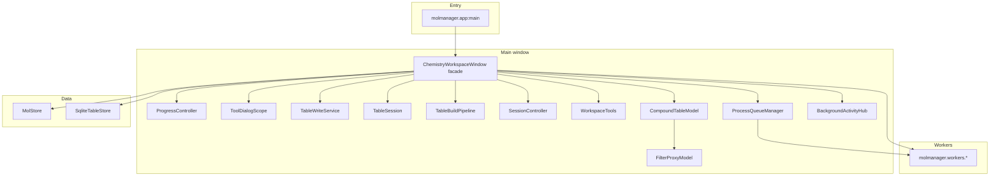

# MolManager architecture

Desktop chemistry table manager: **PyQt5** UI, **RDKit** structures, optional **PyTorch** tools (pKa, permeability).

## High-level layout

## Package layout

`molmanager/` holds no loose modules other than the `app.py` entry point; every module lives in a
subpackage named for its subject. File names describe what the module does, so the flat listing of a
subpackage reads as its table of contents.

| Package | Contents |
|---------|----------|
| `platform_support/` | Process, config, and runtime concerns: `config.py`, `app_logging.py`, `bundled_paths.py`, `wsl_launcher.py`, `qt_webengine_flags.py`, `rdkit_runtime_setup.py`, `memory_guards.py`, `memory_usage.py`, `performance_tracking.py`, `exception_policy.py`, `tool_progress.py` |
| `reference/` | In-app reference content: `help_markdown.py`, `citations_catalog.py`, `method_citations.py`, `descriptor_tooltips.py` |
| `chem/` | Core molecule handling: `molecule_conversion.py`, `smarts_macropatterns.py`, `rdkit_fingerprints.py`, `fingerprint_cache.py`, `fragment_*.py`, `reaction_*.py`, `structure_2d_depiction.py`, `structure_hydrogens.py`, `structure_neutralize.py`, `structure_source_headers.py` |
| `descriptors/` | `descriptors_3d.py`, `medchem_descriptors.py`, `descriptor_cache_reuse.py`, `ml_feature_matrix.py` |
| `conformers/` | Generation and encoding: `conforge_generation.py`, `openbabel_confab.py`, `conformer_column_codec.py`, `ensemble_binary_codec.py`, `conformer_output.py` |
| `ionization/` | `unipka_ensembles.py`, `unipka_enumerator.py`, `microstate_cache.py` |
| `protein/` | Crystallographic structures and overlays: `structure_cif.py`, `structure_atoms.py`, `structure_inventory.py`, `structure_component_types.py`, `hydrogen_bonds.py`, `protein_interactions.py`, `protein_msa.py`, `pharmacophore*.py` |
| `docking/` | `gnina_job.py`, `gnina_launch.py`, `pose_file_io.py`, `search_box.py`, `redock_validation.py` |
| `predictions/` | `som_prediction.py`, `permeability_prediction.py`, `biotransformer_metabolites.py`, `biotransformer_install.py` |
| `sources/` | External compound providers: `chembl_random_compounds.py`, `pubchem_names.py`, `surechembl_api.py`, `random_molecule_sources.py` |
| `analysis/` | `mmp_analysis.py`, `mmp_neighborhood_analysis.py`, `activity_cliff_analysis.py`, `sali_analysis.py`, `qsar_models.py`, `mpo_scoring.py`, `medchem_space.py`, `dimensionality_reduction.py` |
| `plotting/` | Chart computation, no Qt widgets: `plot_axes.py`, `plot_series_collect.py`, `plot_marker_color.py`, `plot_heatmap.py`, `plot_labels.py`, `plot_radar.py`, `plot_statistics_fits.py`, `plotly_legend.py` |
| `table/` | Table data operations and documents: `column_*.py`, `calculator_expressions.py`, `filter_compute.py`, `random_number_columns.py`, `text_file_ingest.py`, `table_file_formats.py`, `session_codec.py`, `structure_depiction_layout.py` |
| `storage/` | `MolStore`, `SqliteTableStore`, `extra_pixmap_store.py`, `structure_render_store.py` |
| `services/` | Pure helpers shared by UI and workers (no Qt, no `molmanager.ui` imports) |
| `workers/` | Background jobs (see *Chemistry workers layout*) |
| `ui/` | Qt widgets, dialogs, and the main window |

Bundled `resources/` are resolved from the package root via
`platform_support.bundled_paths.package_root()`, never from a module's own `__file__`, so modules can
move between subpackages without breaking resource lookup.

## Main window (`molmanager/ui/main_window/`)

`ChemistryWorkspaceWindow` is a **QMainWindow facade** over an explicit GUI-thread kernel
(`molmanager/ui/app_kernel.py`: `AppKernel`) and collaborators. Public methods stay on the
window as one-line forwards so dialogs and tests keep calling `app.on_calc_finished`,
`app._begin_tool_progress`, `app._selected_oids_set`, etc. Most `*_mixin.py` files are
**file-splits of one host class**, not reusable mixins; they are **not** all on the window MRO.

| Collaborator | Module | Owns |
|--------------|--------|------|
| `ProgressController` | `ui/progress_controller.py` | Status chrome, `_begin_tool_progress` / `_finish_tool_progress` |
| `ToolDialogScope` | `ui/tool_dialog_scope.py` | Modeless tool dialogs, selected-rows-only scope, empty-selection abort |
| `TableWriteService` | `ui/table_write_service.py` | `on_calc_finished`, unique column names, `_ensure_columns` |
| `TableSession` | `ui/table_session.py` | Selection, chemistry-column lookup, sticky visible-row cache |
| `TableBuildPipeline` | `ui/table_build_pipeline.py` | Ingest chunks, SQLite rebuild, Render 2D batch/results (`QObject` child) |
| `SessionController` | `ui/session_controller.py` | `.cms` save/restore, table layout, session plots, legacy CSV |
| `WorkspaceTools` | `ui/workspace_tools.py` | Lazy cluster / dimred / QSAR / MPO / medchem / structure-prep adapters |
| `PlotDockHost` | `ui/plot_dock_host.py` | Dock/undock plot panes |
| `ProcessQueueManager` | `ui/process_queue.py` | Serial heavy tools |
| `BackgroundActivityHub` | `ui/background_activity.py` | Processes dialog |

## Mixins vs composition

A mixin is shared behavior used by **more than one** class. Almost all MolManager
`*_mixin.py` modules fail that test: they are method bags for a single host
(`ChemistryWorkspaceWindow`, `PlotWidget`, `CompoundTableModel`, `ProteinViewerDialog`,
`Molecule3DViewerWidget`). State is created on the host `__init__`.

**True mixins** (keep): filter-card chrome (`_FilterCardDragMixin`,
`_FilterCardEnableInvertMixin` in `ui/filters/card_chrome.py`) and
`ProteinStructureSourceMixin` (`ui/dialogs/protein_source_picker.py`).

**Do**

- File-split large Qt classes when one file would be unwieldy.
- Extract a collaborator when there is a stable boundary (progress, column writeback, session IO, ingest/render).
- Put new tools on `WorkspaceTools` (lazy) or as module functions plus `install_window_forwards`.
- Write **new** collaborator methods on the collaborator using `self._app` (`AppKernel`). Do not call `bind_mixin_methods` for new code.
- Keep public names on the window so dialogs/tests keep calling `app.on_calc_finished`.

**Do not**

- Add mixin bases to `ChemistryWorkspaceWindow` (`tests/test_app_kernel.py` freezes the MRO).
- Add empty composite mixins (`ChemistryMixin`-style).
- Treat mixin MRO order as architecture. `QMainWindow` precedes remaining mixins, so Qt virtuals such as `closeEvent` must be declared on the shell (delegating into `AppLifecycleMixin`). Mixin implementations that need the C++ base should call `QMainWindow.closeEvent` explicitly rather than `super()`.

`bind_mixin_methods` is a **legacy bridge**: it copies mixin functions onto a collaborator but still invokes them with the window as `self`. Existing collaborators keep it; convert bodies to `self._app` only when touching that code.

New tools go through `ui/analysis_job_support.py` (which uses `tool_dialog_scope`) and kernel
methods — do not add mixin bases to `ChemistryWorkspaceWindow`.

Remaining mixins on the window MRO are UI adapters that still talk to widgets directly
(`AppMenuMixin`, `TableUIMixin` edit/search/filters, MMP/SALI, dock,
predict, `GuiSettingsMixin`). Empty composition roots (`ChemistryMixin`, `SessionMixin`,
`IngestRenderMixin`, `PrepareStructuresMixin`, `ConformersDescriptorsMixin`,
`ToolsSqlPredictMixin`) are optional groupings only; they are **not** bases of
`ChemistryWorkspaceWindow`.

**Processes Cancel:** `BackgroundActivityHub.try_cancel_row` handles `background` jobs via `cancel_background_job()` when a cancel callable was registered with `register_background_job(..., cancel=…)`. Filter apply, substructure filter, dimred, and MedChem Space register cancel callables.

**Progress chrome (UX Phase 1):** Prepare-structure tools, QSAR train/predict, PDBFixer/PDBQT, dimred, and SQL load pages call `_begin_tool_progress` / `report_tool_progress` / `_finish_tool_progress`. Plot rebuilds register a short-lived Processes row (`Updating plot`) and set status to `Plot: collecting…` before series collect. Render 2D and auto-ingest 2D set status before task collection.

**SQL load:** `SqlLoadWorker` fetches rows and runs `MolFromSmiles` off the GUI thread; `ToolsSqlPredictMixin` applies prepared rows in budgeted `append_rows_batch` chunks. Cancellable via Processes (`register_background_job`).

**SQLite mirror rebuild:** GUI only chunk-exports cell text into memory; `SqliteRebuildWorker` streams inserts + oid index off the GUI (`Indexing table…` progress). Sync `_rebuild_sqlite_store_from_model` remains for tiny/test paths.

**Tool writeback:** `on_calc_finished` inserts columns immediately, then for large result sets chunks `apply_columns_values_bulk` / `set_column_text_by_oids` with `Writing results…` status; coloring and bounds run after the last chunk (`on_complete` for Protonate/fragment/SOM follow-ups). Fingerprint similarity uses the same chunked fill for large tables.

Tool mixins that remain on the window (fragments, MMP/SALI, dock, predict) are thin adapters over `analysis_job_support` and the kernel. Structure-prep (protonate, Fast Prepare, disconnect/neutralize/explicit H) lives on `WorkspaceTools.structure_prep`. Ingest/render/sqlite live on `TableBuildPipeline`; column writeback on `TableWriteService`.

**Filter bounds:** bulk load/ingest calls `schedule_calculate_global_bounds()` (debounced); undo calls `calculate_global_bounds()` immediately when filter cards need fresh min/max. Session restore installs saved `global_bounds` when present and otherwise scans immediately.

## Table and visibility

- **Source of truth:** `CompoundTableModel` (`_rows`, OIDs, batched `dataChanged`) in
  `ui/compound_table_model.py` (file-split: structure / bounds / bulk / color modules).
- **View stack:** `ui/compound_table_view.py` (`CompoundTableView`, `StructureDelegate`,
  `CompoundTableHeaderView`); re-exported from `compound_table_model` for stable imports.
- **Helpers:** `services/numeric_bounds.py` (filter slider min/max scans);
  `column_color_compute.py` (gradient / categorical RGB).
- **Filtered view:** `FilterProxyModel` hides rows by OID set (`set_visible_oids`), not per-row `setRowHidden`.
- **Selection:** Qt selection + `_selected_oids_override` for large selections (tools/plots use `_selected_oids_set()`); logic lives in `TableSession` (`TableSelectionMixin` body).
- **SQLite mirror:** `SqliteTableStore` powers text/numeric filter pushdown and column search at 100k+ rows. Rebuilt in chunks on the GUI thread, then `SqliteRebuildWorker` builds the DB file.

## Background work

| Mechanism | Used for |
|-----------|----------|
| `ProcessQueueManager` | Serial heavy tools (descriptors, cluster, export, …) |
| `threadpool` | Substructure filter, dimred, MedChem space, SQLite export chunks |
| `_render_threadpool` | 2D structure rendering |
| `_background_jobs` + `BackgroundActivityHub` | **Processes** dialog rows for non-queue work |

Progress: `WorkerSignals.tool_progress` + `ToolProgressState` polling → bottom `status_label`.

## Plots and table sync

- **Plotter:** `ui/plot.py` (`PlotWidget`)
- **Dock host:** `ui/plot_dock_host.py` (`PlotDockHost`) owns dock/undock, panel width, and pane close; `PlotToolsMixin` delegates the public API
- **PCA / radar / dimred:** `ui/plotly_interactive_view.py`; dimred panel is `ui/dialogs/dimred_panel.py` (`DockableResultPlotPanel`), method dialogs stay in `ui/dialogs/dimensionality_reduction.py`
- **MedChem space:** `ui/dialogs/medchem_space.py` (`MedChemPlotPanel` also subclasses `DockableResultPlotPanel`)
- **Shared helpers:** `ui/plot_table_sync.py` (selection mapping, clear override); `ui/plotly_shell.py` + `ui/plotly_shell.html` (interactive Plotly HTML/JS for Plotter + Plotly views)
- **Result maps:** `ui/result_plot_panel.py` (`DockableResultPlotPanel`) is the shared dock chrome for SALI / MMP / cliffs / dimred / MedChem
- **Docked-plot chrome:** `ui/dockable_plot.py` re-exports glyphs, floating titles, footer buttons, and pane embed (`dockable_plot_glyphs.py`, `_title.py`, `_chrome.py`, `_embed.py`)
- **Workspace panes:** `ui/main_window/plot_pane.py` (`PlotPane`); `ui/main_window/workspace_layout.py` (`WorkspaceLayoutManager`)
- **Result browsers:** `ui/browsers/` (SOM, selection, MMP, SALI, metabolites) with shims at `ui/*_browser.py`
- **Filters:** `FilterPanelMixin` is a file-split of the window filter panel (cards/apply/substructure/bounds) under `ui/filters/`. True mixins are card chrome only (`card_chrome.py`); `cards.py` is the barrel.
- **Conformer writeback:** `ui/main_window/conformer_writeback.py` (table append / packed ensemble / superpose mol lookup); `ConformersToolsMixin` stays the UI adapter
- **Table → plot:** debounced `_schedule_sync_active_plots_from_table_selection`
- **Plot → table:** `apply_table_selection_for_source_rows`
- **Filters / edits:** `_schedule_active_plots_replot` after filter apply; `dataChanged` on model for open plots
- **Substructure (large tables):** one or more SMARTS cards run via `SubstructureFilterWorker` off the GUI; sync/chunked apply consume override OID sets
- **UI workflow benchmark:** `scripts/benchmark_ui_workflows.py` times CSV load, `.cms` restore, filters, plot collect/replot, search, export
- **pKa / Uni-pKa benchmark:** `scripts/benchmark_pka.py` splits enumerate vs Uni-pKa MMFF/LMDB vs Uni-Mol infer and compares chunk sizes

## Adding a new Tool

1. Dialog under `molmanager/ui/dialogs/` (use `scope.selection_scope_checked`, `parent_app` on docked panels).
   Protein Prepare, Gnina dock, and Data Analysis live there; shims remain at the old `ui/`
   paths. Package `__init__` loads exports lazily so submodule imports do not pull Qt WebEngine.
2. Worker under `molmanager/workers/` if work is heavy.
3. Wire the menu action on `ChemistryWorkspaceWindow` as a **thin forward** to `WorkspaceTools` or an existing collaborator (`install_window_forwards`). Do **not** add a new mixin base to the window class. New collaborator methods use `self._app`, not `bind_mixin_methods`.
4. Long jobs: `process_queue.enqueue` + `_begin_tool_progress` / `report_tool_progress`.
5. Short threadpool jobs: `register_background_job` / `unregister_background_job`.
6. Tests under `tests/` (unit tests avoid full GUI where possible).

## Chemistry workers layout

Heavy chemistry jobs are split by concern (compat re-exports remain in `workers/chemistry_tools.py` and `workers/chemistry_conformers.py`):

| Module | Responsibility |
|--------|----------------|
| `workers/chemistry_descriptors.py` | Descriptor `CalcWorker` |
| `workers/conformer_generation.py` | Stochastic ETKDG conformer generation |
| `workers/superpose.py` | QRunnable adapters; re-exports geom/conformers/structures/RMSD |
| `workers/superpose_geom.py` | Ring maps, 2D depiction match, atom maps |
| `workers/superpose_conformers.py` | Align conformers of one molecule |
| `workers/superpose_structures.py` | Align distinct molecules onto a reference |
| `workers/superpose_rmsd.py` | Per-conformer RMSD |
| `workers/strain_energy.py` | Strain energy + overlay helpers |
| `workers/chemistry_calc.py` | Custom calculator (AST `calculator_expressions`) |
| `workers/chemistry_worker_common.py` | Shared progress throttling and force-field names |

Pure helpers live under `molmanager/services/` (e.g. `chemistry_columns.py`, `sql_load_policy.py`,
`table_scope.py`, `activity_records.py`, `table_selection.py`, `sqlite_text_match.py`,
`filter_config.py`, `column_labels.py`, `structure_grouping.py`). Domain modules must not import
`molmanager.ui`; Plotly legend cleanup lives in `molmanager/plotting/plotly_legend.py` (re-exported from
`ui/plotly_html.py`). Shared lineage header is `COLUMN_PARENT_OID` (`"Parent OID"`).
MMP / Activity Cliff / Pair Network / SALI share `ui/analysis_job_support.py` for scoped
activity-record prep, process-queue enqueue (`start_scoped_activity_job`), dialog open/finish
helpers (`ensure_activity_analysis_ready`, `finish_analysis_pairs`, `report_analysis_failure`).
Cluster / pKa / SOM / protomer / permeability reuse the same module for table readiness
(`ensure_table_ready_for_tool`), structure-scoped mol collect (`prepare_scoped_structure_mols`),
enqueue (`enqueue_process_queue_job` / `start_scoped_structure_job`), and cancellable failure
reporting (`report_cancellable_job_failure`). Tool adapters and dialogs stay thin over those helpers.

Filter visibility changes invalidate a sticky `_visible_source_rows_cache` used by
plot replot (so debounced Plotter rebuilds do not rematerialize proxy maps per host).
`FilterProxyModel` is an explicit OID→row map (`QAbstractProxyModel`): `set_visible_oids`
rebuilds the accepted source-row list once instead of
`QSortFilterProxyModel.invalidateFilter` walking every row. `visible_source_rows()` seeds
the sticky cache without a `mapToSource` loop. Column insert/remove is forwarded 1:1
(`beginInsertColumns` / `beginRemoveColumns`) so the table view updates section count;
without that, deletes leave blank columns and new descriptor columns never appear.
When visibility does not change, finalize skips reset/replot.

Plotter axis/mode/histogram helpers live in `molmanager/plotting/plot_axes.py` (re-exported from
`ui/plot.py`). Series collection for scatter/histogram lives in `molmanager/plotting/plot_series_collect.py`.
Floating plot chrome is split into `ui/plot_bridge.py`, `ui/plot_statistics_panel.py`, and
`ui/plot_dialog.py`. Figure / shell / style / axis / radar / collect / session modules under
`ui/plot_*_mixin.py` are a **file-split of `PlotWidget`** (`ui/plot.py` owns UI construction).
Fingerprint session cache is an LRU capped by `fingerprint_cache_max_entries`
(`MOLMANAGER_FINGERPRINT_CACHE_MAX_ENTRIES`).

Ligand 3D viewer: `ui/mol_viewer_3d.py` re-exports. HTML/JS assembly is
`ui/mol_3d_html.py` (shared `assemble_3dmol_shell_page`), RDKit 2D/3D prep is
`ui/mol_3d_prepare.py`, Qt widgets are `ui/mol_3d_widget.py` (conformer nav + dock chrome mixins), and the floating
dialog/openers are `ui/mol_3d_dialog.py`. The sketcher embed is `ui/mol_3d_embed.py`;
strain-energy table fill is `ui/mol_3d_strain.py`. Protein viewer: `ui/protein_viewer.py`
re-exports; HTML is `ui/protein_viewer_html.py`, canvas is `ui/protein_embed.py`,
chain list is `ui/protein_chain_manager.py`. The window (`ui/protein_viewer_dialog.py`) is a file-split (IO/session, render-style/H-bond, sequence).
Crystallographic inventory: `structure_components.py` re-exports types, CIF IO,
chain inventory, and atoms/pocket helpers.
`TableWriteService` owns descriptor/tool column writeback and unique header naming.
Structure-prep tools (protonate, Fast Prepare, disconnect/neutralize/explicit H) live on
`WorkspaceTools.structure_prep`; Render 2D start/flush lives on `TableBuildPipeline` with ingest and SQLite rebuild.
Protein Prepare runtime: `workers/protein_prepare_runtime.py` orchestrates;
IO/residue maps are `protein_prepare_io.py`, pdb2pqr is `protein_prepare_pdb2pqr.py`,
AmberTools GAFF/GAFF2 (WSL on Windows) is `protein_prepare_amber.py`,
OpenMM min is `protein_prepare_minimize.py`. Complex-only Minimize (viewer **Minimize…**) is `protein_complex_minimize.py` with dialog `ui/dialogs/protein_minimize.py`. Tests patch names on the runtime module.

Gnina dock: `ui/dialogs/gnina_dock.py` is the widget. Argv, ligand files, and pose
I/O live in `gnina_job.py` (no Qt). `workers/gnina_dock_worker.py` owns the
`QProcess` and dock → optional crystal validation → optional minimize sequencing.
Launch/WSL/GPU probing stays in `gnina_launch.py`. Compat shims remain at
`ui/gnina_dock.py` / `ui/smina_dock.py`.

Auto Render 2D after ingest/session: the loading overlay stays until filter bounds
are ready and restored plot views have settled. Auto Structure renders start in the
background and do not block the workspace. Above `auto_render_2d_max_rows` auto 2D
is skipped. Lazy PNG store thresholds (`structure_render_lazy_*`) still control how
images are stored, not when the workspace appears. Session files store 2D mol
binaries and numeric filter bounds so Open can skip SMILES re-parse and a full
bounds scan.

## Related docs

- [CONTRIBUTING.md](CONTRIBUTING.md) — coding standards, CI lint/headers, dependency audit
- [STEREO_AND_ISOMERISM.md](STEREO_AND_ISOMERISM.md)
- [VALENCE_BONDS_AND_AROMATICITY.md](VALENCE_BONDS_AND_AROMATICITY.md)
- [PACKAGING.md](PACKAGING.md)
